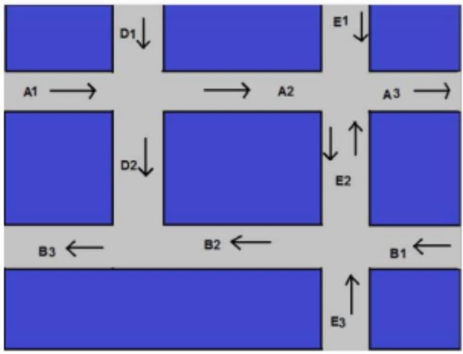

## Overview

PageRank is a link analysis algorithm used to rank nodes in a graph based on their importance. The central idea is that a node is important if it is linked to by other important nodes.

The recursive definition:
PR(u) = (1 − α) + α * Σ [ PR(v) / L(v) ] for all v ∈ B(u)

Where:  
- `PR(u)` is the PageRank of node `u`  
- `B(u)` is the set of nodes linking to `u`  
- `L(v)` is the number of outgoing links from node `v`  
- `α` is the damping factor

---

## Implementation Details

### Algorithms Used

1. **Power Iteration**
2. **Eigenvalue decomposition**
3. **NetworkX Builtin PageRank**

---

## Experiment 1: Web Graph (web-BerkStan)

Applied PageRank using all three methods on a real-world dataset of ~1000 nodes.

### Results for Different Damping Factors

| α (damping) | Top Pages |
|-------------|-----------|
| 0.75        | Page 39    |
| 0.85        | Pages 860, 767 |
| 0.95        | Page 860   |

### Performance

| Method                | Runtime |
|-----------------------|---------|
| Power Iteration       | 126 ms  |
| Eigen Decomposition   | 1.61 s  |
| NetworkX PageRank     | (Slower than Eigen) |
---

## Experiment 2: Synthetic Road Graph

A small graph of 11 nodes with specific paths labeled A–E.  
We computed both **node ranks** and **edge ranks** based on PageRank scores and link importance.

### Top Nodes (α = 0.85)

- Node 4: 0.1712  
- Node 8: 0.1642  
- Node 6: 0.1549

### Top Edges by Rank

| Edge   | Edge Rank |
|--------|-----------|
| (4, 5) | 0.1455    |
| (8, 7) | 0.1395    |
| (4, 8) | 0.0728    |
| (3, 4) | 0.0777    |
| (7, 6) | 0.1211    |

---

## Damping Factor α

The damping factor controls the probability of a random jump vs. following links:

- **α = 0.95**: Strong dependence on graph structure. Pages with many high-quality incoming links dominate.
- **α = 0.75**: Introduces more randomness, allowing less-connected nodes to rank higher.
- **α = 0.85**: Often used as a balanced tradeoff in practice.
